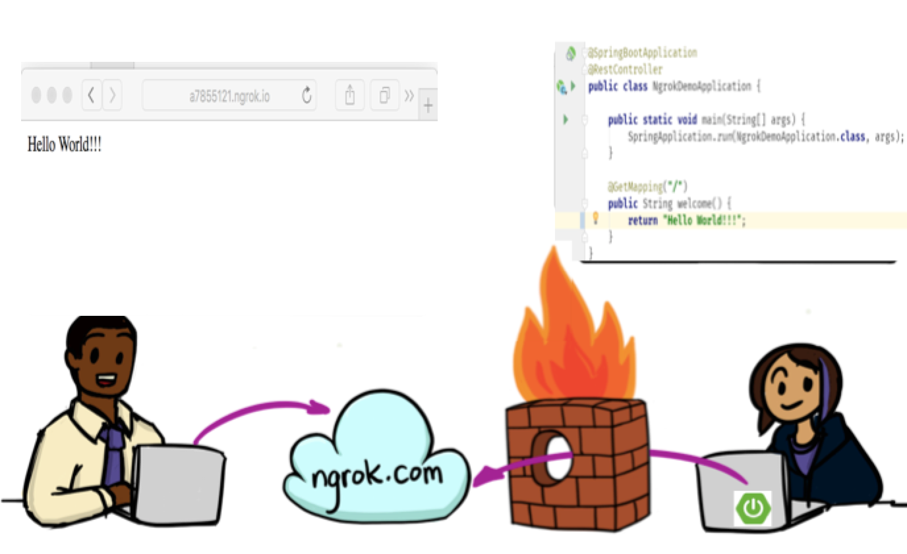

ngrok-spring-boot-start
=========================
Spring boot starter for ngrok, easy to expose a local Spring Boot Application to the internet



### Usage

* Start local ngrok tunnels： ngrok start --none

* Add ngrok-spring-boot-starter in your pom.xml:
```xml
          <dependency>
                     <groupId>com.mvnsearch.spring.boot</groupId>
                     <artifactId>ngrok-boot-starter</artifactId>
                     <version>1.0.0-SNAPSHOT</version>
          </dependency>
```
* Get public url for spring boot application:
    
    * ngrok web inspection http://localhost:4040  or ngrok terminal console
    * ngrok endpoint in spring boot application: http://localhost:8080/ngrok
    * public url output in Spring Boot console

### Functions

* ngrok web inspection: http://localhost:4040
* Inspecting your traffic
* Replaying requests

### how it works

The starter automate ngrok via API(http://127.0.0.1:4040/api/)

### References

* ngrok: https://ngrok.com/

